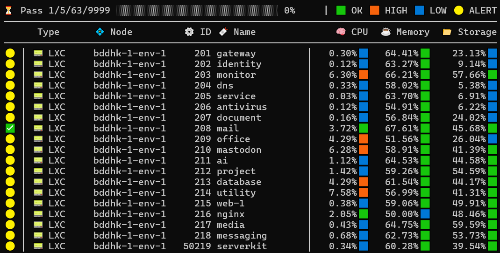
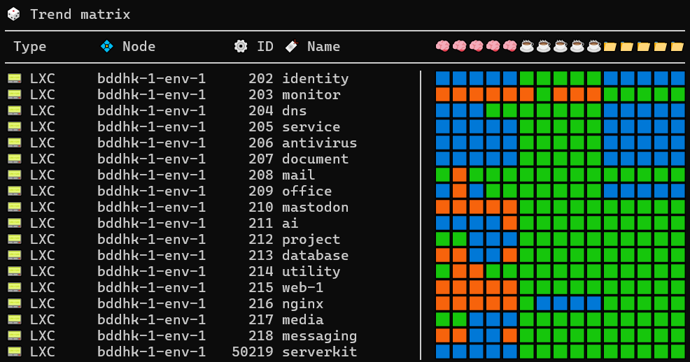
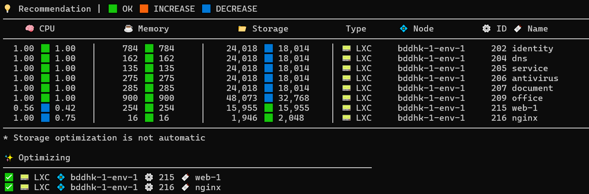
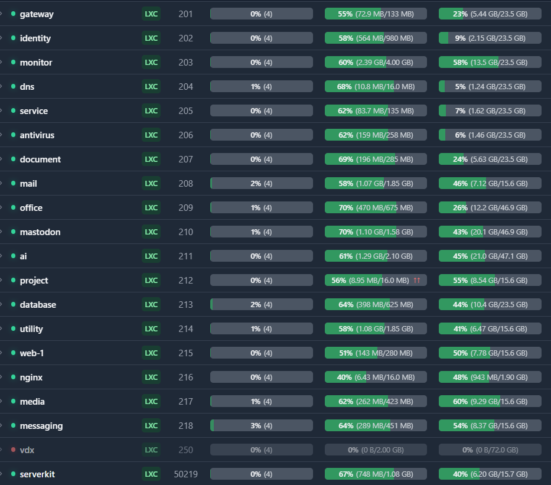

# 🐛 Proxmox VE Optimizer

- **Version**: `1.0.1`
- **Type**: Command line tool
- **Programming language**: `PHP`
- **Platform**: `Linux`

This is a command-line tool to monitor a `Proxmox VE` instance and dynamically optimize `LXC`/`VM` resources. The tool collects multiple sampling data for `CPU`, `Memory` and `Storage` consumption and optimizes the resources as required. This is completely autonomous. The ultimate goal is to keep the `CPU`, `Memory` and `Storage` consumptions within a safer level.

**💡 A little background**: I have been playing with my `Proxmox VE` home lab and fatigued to notice that I had to have a constant watch on the `LXC`/`VM` items just to balance the loads and keep the system happy! It is a stone aged `Lenovo Z40-70` from 2009 upgraded with two `SSD`s. So I needed a replacement of me 😉 And yeah, pathetically of course, `PHP` is the only thing I could do... 😄

## 🖥️ Command Line Display (Primary Visualization)

The tool provides real-time, symbol-based progress flow display directly in the command line. The following screenshots demonstrate the output:


*Figure: Pass display showing progress bar, resource load status, and color-coded indicators*


*Figure: Trend matrix showing CPU/Memory/Storage trends across all passes*


*Figure: Recommendation values and optimization results*


*Figure: System settlement after optimization (stat taken with Pulse for Proxmox)*

## 🛠️ How it works?

The tool operates by collecting resource metrics from Proxmox VE and applying optimizations using Proxmox VE's resource management features:

1. **Configuration**: Configure relevant resource alert levels, limits, and other settings in the `.env` file
2. **Data Collection**: The tool conducts multiple data sampling from the target `Proxmox VE` instance through **API**
3. **Analysis**: The tool determines optimized resource values depending on the `.env` configuration and predefined thresholds
4. **Optimization**: The tool uses Proxmox VE's **CPU limit** feature to manage CPU allocation, and applies memory allocation changes to optimize resources

**Important**: While the tool detects `CPU load` (usage percentage) to determine trends and make optimization decisions, it applies changes using Proxmox VE's **CPU limit** feature, which sets the maximum CPU cores/threads allocated to each LXC/VM. This is a crucial distinction - the tool doesn't directly control CPU usage, but rather the maximum CPU capacity available to each resource.

The process flow:
```
[Start] → Load Configuration → Scan Resources (Multiple Passes) → Analyze Trends → Generate Recommendations → Apply Optimization → Email Report (AI Analysis) → Webhook Notification
```

## ✨ Features

- **🤖 Autonomous operation**: No user interaction is necessary once configured
- **📧 Email alerts**: Email notification of optimization actions with configurable intervals
- **🔗 WebHook support**: Submit complete optimization process data to remote endpoints
- **🧠 AI analysis**: AI-generated review in email on the optimization process using OpenAI-compatible API
- **🖥️ Real-time display**: Real-time display of the full operation with progress indicators
- **📋 Recommendation-only mode**: Preview recommendations without applying changes
- **🔒 Single instance protection**: Prevents multiple instances from running simultaneously
- **🖥️ Exit instructions**: Press `CTRL + C` to exit the tool manually

## ⚙️ Configuration

### Environment Variables (`.env`)

All configuration is managed through environment variables in the `.env` file. An [`example.env`](example.env) file is provided as a template. **Always use values from `example.env` for production documentation** as the actual `.env` may contain test values not suitable for production.

**⚠️ Important**: When setting up for production, copy `example.env` to `.env` and update all placeholder values with your actual configuration.

#### 📡 Proxmox VE API Configuration

| Variable | Description | Default |
|----------|-------------|---------|
| `PVEO_API_BASE_URL` | Proxmox VE API base URL | `https://proxmox.domain.tld` |
| `PVEO_API_PVE_USER` | API user (e.g., `root@pam`) | `root@pam` |
| `PVEO_API_ID` | API token ID | `Test` |
| `PVEO_API_TOKEN` | API token secret | `1234abcd-12ab-12ab-12ab-123456abcdef` |
| `PVEO_API_CONNECTION_TIMEOUT` | Connection timeout in seconds | `30` |

#### 📊 Resource Thresholds

| Variable | Description | Default |
|----------|-------------|---------|
| `PVEO_RESOURCE_CPU_THRESHOLD_LOW` | CPU load below this is considered low (%) | `2` |
| `PVEO_RESOURCE_CPU_THRESHOLD_HIGH` | CPU load above this is considered high (%) | `4` |
| `PVEO_RESOURCE_MEMORY_THRESHOLD_LOW` | Memory usage below this is considered low (%) | `50` |
| `PVEO_RESOURCE_MEMORY_THRESHOLD_HIGH` | Memory usage above this is considered high (%) | `70` |
| `PVEO_RESOURCE_STORAGE_THRESHOLD_LOW` | Storage usage below this is considered low (%) | `33` |
| `PVEO_RESOURCE_STORAGE_THRESHOLD_HIGH` | Storage usage above this is considered high (%) | `67` |

#### 📈 Resource Change Factors

| Variable | Description | Default |
|----------|-------------|---------|
| `PVEO_RESOURCE_CPU_LIMIT_INCREMENT` | CPU limit increase factor (%) - Applied to Proxmox VE's **CPU limit** feature | `25` |
| `PVEO_RESOURCE_CPU_LIMIT_DECREMENT` | CPU limit decrease factor (%) - Applied to Proxmox VE's **CPU limit** feature | `25` |
| `PVEO_RESOURCE_MEMORY_INCREMENT` | Memory increase factor (%) | `25` |
| `PVEO_RESOURCE_MEMORY_DECREMENT` | Memory decrease factor (%) | `25` |
| `PVEO_RESOURCE_STORAGE_INCREMENT` | Storage increase factor (%) | `25` |
| `PVEO_RESOURCE_STORAGE_DECREMENT` | Storage decrease factor (%) | `25` |

#### 📏 Resource Limits

| Variable | Description | Default |
|----------|-------------|---------|
| `PVEO_RESOURCE_CPU_LIMIT_MINIMUM` | Minimum CPU limit (cores) - Proxmox VE **CPU limit** setting | `0.25` |
| `PVEO_RESOURCE_CPU_LIMIT_MAXIMUM` | Maximum CPU limit (cores) - Proxmox VE **CPU limit** setting | `1` |
| `PVEO_RESOURCE_MEMORY_MINIMUM` | Minimum memory (MB) | `16` |
| `PVEO_RESOURCE_MEMORY_MAXIMUM` | Maximum memory (MB) | `4096` |
| `PVEO_RESOURCE_STORAGE_MINIMUM` | Minimum storage (MB) | `2048` |
| `PVEO_RESOURCE_STORAGE_MAXIMUM` | Maximum storage (MB) | `32768` |

#### ⚡ Optimization Process

| Variable | Description | Default |
|----------|-------------|---------|
| `PVEO_PASS_COUNT` | Number of sampling passes per optimization cycle | `5` |
| `PVEO_PASS_INTERVAL` | Seconds between passes | `3` |
| `PVEO_OPTIMIZE_COUNT` | Number of optimization cycles to run | `1` |
| `PVEO_RECOMMENDATION_ONLY` | `true` = Only show recommendations, `false` = Apply automatically | `false` |

#### 📧 SMTP Configuration

| Variable | Description | Default |
|----------|-------------|---------|
| `PVEO_SMTP_HOST` | SMTP server host | `smtp.domain.tld` |
| `PVEO_SMTP_PORT` | SMTP server port | `465` |
| `PVEO_SMTP_SECURITY` | SMTP security (`NONE`, `SSL`, `TLS`) | `SSL` |
| `PVEO_SMTP_USER` | SMTP username | `no-reply@domain.tld` |
| `PVEO_SMTP_PASSWORD` | SMTP password | `SMTP-PASSWORD` |
| `PVEO_SMTP_FROM_NAME` | Email from name | `PVE Optimizer` |
| `PVEO_SMTP_FROM_EMAIL` | Email from address | Same as SMTP user |
| `PVEO_NOTIFICATION_EMAIL` | Recipient email(s), comma-separated | `admin@domain.tld` |
| `PVEO_NOTIFICATION_EMAIL_DELAY` | Minimum seconds between emails | `3600` |

#### 🔗 WebHook Configuration

| Variable | Description | Default |
|----------|-------------|---------|
| `PVEO_WEBHOOK_IDENTITY` | Identity string sent to webhook - Identifies the Proxmox VE instance to the external system | `proxmox.domain.tld` |
| `PVEO_WEBHOOK_BEARER_AUTHORIZATION_KEY` | Bearer authorization key | `WebHook-Secret-Authorization-Key` |
| `PVEO_WEBHOOK_URL` | Webhook endpoint URL | `https://monitor.domain.tld/webhook/custom/pveo.php` |

#### 🤖 AI (OpenAI) Configuration

| Variable | Description | Default |
|----------|-------------|---------|
| `PVEO_OPENAI_API_BASE_URL` | OpenAI-compatible API base URL | `http://openwebui.domain.tld:8080` |
| `PVEO_OPENAI_API_KEY` | API key | `sk-1234abcd1234abcd1234abcd1234abcd` |
| `PVEO_OPENAI_MODEL` | Model ID (format: `base:variant`) | `qwen3-coder-next:latest` |

AI analysis is included in email notifications only. The AI generates a professional HTML report based on the optimization data.

#### 📝 Log Configuration

| Variable | Description | Default |
|----------|-------------|---------|
| `PVEO_PHP_ERROR_LOG_SIZE_LIMIT` | Maximum PHP error log size in KB before rotation | `10` |

**💡 Note**: All default values in this documentation are sourced from [`example.env`](example.env) and are suitable for production use. Values in your local `.env` file may differ and should be updated accordingly.

## 🔄 `CPU` reverse logic

The **Reverse CPU Logic** is designed to maintain system stability:

- **When enabled (`true`)**:
  - High CPU consumption → **Reduce** CPU allocation to prevent system overload
  - Low CPU consumption → **Increase** CPU allocation to allow faster processing
  - This implements a CPU load balancing mechanism

- **When disabled (`false`)**:
  - High CPU consumption → **Increase** CPU allocation for faster task completion
  - Low CPU consumption → **Decrease** CPU allocation to free up resources

This logic is **optional** and can be disabled in the `.env` file to use simple proportional logic.

## 📁 Storage Optimization

**Storage optimization is manual**. The tool will only show recommended values for storage. This is due to complexity in storage management in Proxmox VE.

## 📤 Output

### JSON Data (`Data.json`)

The JSON output is a **secondary feature** designed for use with WebHook or manual consumption by other applications. After each optimization cycle, a `Data.json` file is created containing:

- Optimization process metadata
- Resource thresholds used
- Pass-by-pass data for each resource
- Applied recommendations
- Resource trend analysis

This file can be used by external visualization/monitoring applications, or consumed by webhook endpoints.

### Email Reports

Email notifications include:

- Trend matrix showing CPU/Memory/Storage status across all passes
- Optimization recommendations with before/after values
- Applied changes summary
- **AI-generated analysis** in HTML format

### WebHook Notifications

A POST request is sent to the configured WebHook URL with:

```json
{
  "Identity": "webhook-identity",
  "Optimization": {
    // Full optimization data from Data.json
  }
}
```

## Usage

```bash
# 📋 Copy example environment file
cp example.env .env

# 🛠️ Edit .env with your Proxmox VE configuration
# ...

# ▶️ Run the optimizer
php start.php
```

## 🔧 External Libraries

This project uses the following external libraries:

- **[PHPMailer](https://github.com/PHPMailer/PHPMailer)**: A full-featured email creation and transfer class for PHP
- **[VLucas/PHPdotenv](https://github.com/vlucas/phpdotenv)**: Loads environment variables from `.env` files

## 👨‍💻 Developer

- **Name**: [**Broken Arrow**](https://bogus.boo)
- **Email**: [Boss@Bogus.Boo](mailto:Boss@Bogus.Boo)
- **📅 Last update**: March 15th, 2026

## ⚠️ Disclaimer

This is a **hobby project for fun**. This is **not** intended to demonstrate any industry-standard coding skills. The code is provided as-is for educational and personal use.

## 📄 License

This project is provided as-is for educational and administrative purposes.
